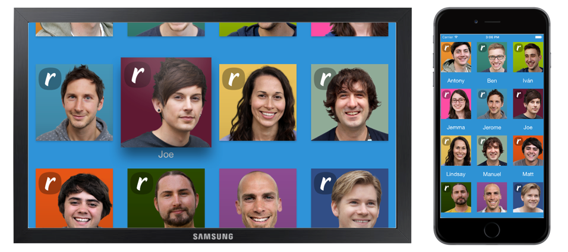

# Team ribot
[![iOS Dev Weekly] (https://img.shields.io/badge/iOS%20dev%20Weekly-%23238-blue.svg)](https://iosdevweekly.com/issues/238?sid=UyBQ3w#start)  [![indie iOS focus weekly] (https://img.shields.io/badge/indie%20iOS%20focus%20weekly-%2356-green.svg)](https://indieiosfocus.curated.co/issues/56?#start)
=

This is a sample project created with the aim of sharing functionalities and code between iOS and tvOS. It's main functionality is display a list of [ribots](http://ribot.co.uk/us) with their ribotars and names.

<p align="center">
    
</p>


This project is open sourced to showcase how you can shared code between different targets. There is a [medium post](https://medium.com/ribot-labs/sharing-functionality-across-tvos-and-ios-228c76b03a06#.er4pbltoq) which details this concept and walks through the basics of it.


# Libraries

- Alamofire
- AlamofireImage

# Requirements

- Xcode 7
- iOS 9.0
- tvOS 9.0

# Licence

```
Copyright 2016 Ribot Ltd.

Licensed under the Apache License, Version 2.0 (the "License");
you may not use this file except in compliance with the License.
You may obtain a copy of the License at

    http://www.apache.org/licenses/LICENSE-2.0

Unless required by applicable law or agreed to in writing, software
distributed under the License is distributed on an "AS IS" BASIS,
WITHOUT WARRANTIES OR CONDITIONS OF ANY KIND, either express or implied.
See the License for the specific language governing permissions and
limitations under the License.
```


